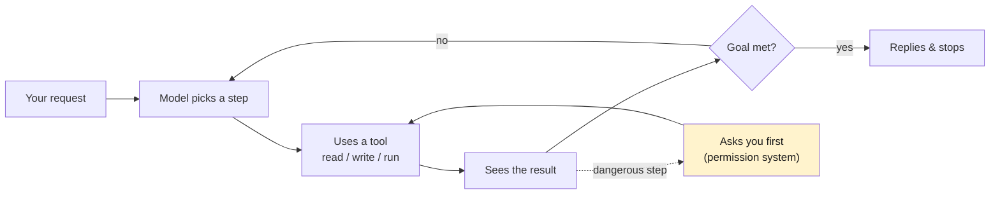

# Part 1 — opencode as an AI harness

> **Goal:** understand what an *AI harness* is, why it is a different thing from the
> *model*, and why working through one changes how you develop.
> opencode docs (English): <https://opencode.ai/en/docs/>

## What is an AI harness?

A **harness** is the program that wraps an [LLM](../glossary.md#llm) and lets it act on the world. Without a harness, an LLM is only a chat box: it can talk, but it cannot read your files, run your tests, or edit your code.

opencode is a harness. So are Claude Code, Cursor's agent mode, and Cline. They all share the same shape: they give the model **[tools](../glossary.md#tools-and-function-calling)**, keep a **[context window](../glossary.md#context-window)** of the conversation, and run in a **loop** until the task is done or until you stop it.

### Harness vs model — do not confuse them

This is the single most important distinction in the guide. People who miss it blame the wrong thing when something goes wrong.

| | Model | Harness |
|---|------|---------|
| **What it is** | The brain (an LLM like DeepSeek, Claude, GPT) | The body (opencode, Claude Code, Cursor) |
| **What it does** | Decides the next step, writes text/code | Gives the model files, tools, permissions, the loop |
| **You control it by** | Picking which model, writing good intent | Writing rules, skills, permissions, prompts |
| **Can be swapped?** | Yes — same harness, different model | Yes — same model, different harness |

> **The harness is what makes the model follow your solution.** A bare chat model has no reason to obey your repo conventions. A harness lets you *enforce* them — through `AGENTS.md` and skills (Parts 4–5).

## What is an "AI mode"?

"AI mode" (or **[agentic](../glossary.md#agent)** mode) means the model works in a loop: it looks at your request, picks a tool, reads the result, decides the next step, and repeats — with your permission at the dangerous parts.

The loop is the whole difference from chat. In chat you paste a question and get one answer. In agentic mode the model *drives* — it reads your code, runs your build, reads the error, fixes the file, runs it again. You move from "typing every step" to "approving steps".

### A concrete trace

You type: *"`addUser` throws when email is empty — find why and fix it."* The harness does not ask you for the file. It runs itself:

1. runs `grep -rn "addUser"` to find the function,
2. reads the file and traces the call,
3. sees the empty-email path has no guard,
4. edits the file to add the guard,
5. runs your test command, reads the failure if any, and loops.

You review the final diff and approve. That loop — search → read → edit → run → check — is what a harness gives you that a chat window cannot.

## VS Code alone vs an AI harness

You already know the old way. Here is the honest comparison — not "AI is magic", just what actually shifts.

| You want to… | VS Code (you drive) | opencode harness (model drives, you approve) |
|---|---|---|
| **Find where a bug is** | You grep, read files, trace the call. | You describe the symptom. The model greps, reads, and traces, then shows you which files it read. |
| **Make a change across 8 files** | You open each file, edit each, keep them consistent yourself. | The model edits all 8, keeping them consistent. You review the diff. |
| **"Why does this work this way?"** | You read and reason about it. | The model reads and explains, with file references you can click. |
| **Refactor safely** | You change, then run tests yourself. | The model changes and runs the tests in the loop, fixes until green. |
| **The boring parts** | Yours. | The model's — boilerplate, migrations, tests for the change it just made. |

The shift is who does the mechanical typing and searching. You still own architecture, trade-offs, and review. The harness does the typing, the searching, and the running — under your control.

### What does NOT change

- **You own the design.** The model cannot decide your architecture. It will propose one, often reasonable, sometimes wrong. You judge.
- **You own review.** "The model wrote it" is not "it is correct." Read the diff like a peer wrote it. (See [Part 4](../04-agents-md/README.md) for making this cheaper.)
- **You own correctness.** The model is probabilistic — it can sound completely sure and still be wrong (a [hallucination](../glossary.md#hallucination)). Tests and your eyes on the diff are the safety net, not the model's confidence.

## Why a harness instead of a chat window

A chat window cannot see your repo unless you paste it, cannot edit a file and run the build to check itself, and has no place for *your* rules. The harness adds exactly these — so the rest of this guide is about *controlling the harness*, because that is where your leverage is.

---

## Cheat-sheet

**Do**
- Treat model and harness as separate. Swap models freely; keep your rules and skills.
- Move to "approve steps" instead of "type every step."
- Keep owning design, review, and correctness.

**Don't**
- Don't trust the model's confidence. Trust tests and your eyes on the diff.
- Don't expect chat-window behavior — the loop is what makes a harness different.

**One snippet** — the mental model in one line:
> opencode = (your rules) + (a model) + (tools) + (a loop). You set the first and last.

---

[← Back to index](../README.md) · [→ Part 2: DeepSeek as a cheap LLM](../02-deepseek/README.md)
