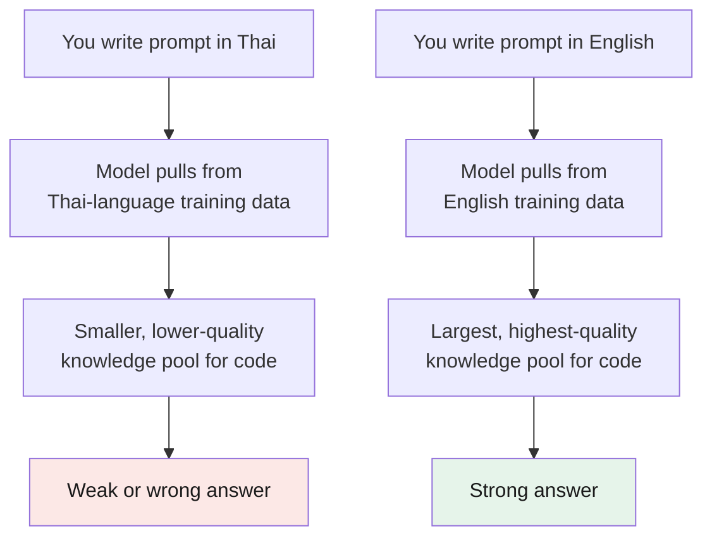

# Part 2 — DeepSeek as a cheap LLM

> **Goal:** understand why model choice matters for cost, where DeepSeek sits, and the
> real reason a "Chinese model" can feel worse — and how to fix it.
> Prices and model names change often — treat this as a snapshot and verify before relying on the numbers.

## Why cost matters

In an [agentic](../glossary.md#agent) loop the model is called many times per task — read a file, think, edit, run a test, read the error, think again. A single change can mean dozens of calls. At that volume, the **per-token price** of the model decides whether you can run the harness all day or whether you must watch the cost.

[Tokens](../glossary.md#tokens) are how you are billed: roughly 100 tokens ≈ 75 words. Two numbers matter — **input** (what you send, including files and history) and **output** (what the model writes back). Output usually costs more.

## What is DeepSeek?

DeepSeek is a Chinese AI lab. Its models are open-weight (you can read the license and run some yourself) and are known for strong coding ability at a very low price. In opencode you point the harness at the DeepSeek API and it behaves like any other model — the [harness does not care which lab made the brain](../01-opencode/README.md#harness-vs-model--do-not-confuse-them).

## The price gap

Per **1 million tokens**, USD. Source: each vendor's official pricing page.

| Model | Vendor | Input | Output | Notes |
|---|---|---|---|---|
| **DeepSeek-V4 Flash** | DeepSeek | **$0.14** | **$0.28** | Budget coding tier, 1M-token context |
| DeepSeek-V4 Pro | DeepSeek | $0.435 | $0.87 | Flagship, 1.6T-param MoE |
| GLM-4.6 | Zhipu / Z.AI | $0.60 | $2.20 | Value tier |
| Kimi K2.6 | Moonshot | $0.95 | $4.00 | Mid tier |
| Claude Sonnet 5 | Anthropic | $2.00–$3.00 | $10–$15 | Intro price rises Sep 2026 |
| GPT-5.6 Sol | OpenAI | $5.00 | $30.00 | Flagship |
| Claude Opus 5 | Anthropic | $5.00 | $50.00 | Top tier |

> **The core point:** on output price, DeepSeek-V4 Flash ($0.28) is **about 36× cheaper than Claude Sonnet 5** ($10) and **about 180× cheaper than Claude Opus 5** ($50). For a tool you run hundreds of times a day, that is the difference between "leave it on" and "be careful before every call."

### Is it actually good at coding?

Honest answer: the top Western models still lead the most-cited coding benchmark, but the gap is small and closing.

- **SWE-bench Verified** (the standard "can it fix real bugs in real repos" benchmark): the official audited leaderboard is led by top Western models (Claude Opus 4.5 high-reasoning at ~76.8% as of mid-2026). Chinese models are close behind and rising fast.
- **For everyday dev work** — reading code, editing across files, writing tests, refactoring — DeepSeek and GLM are more than good enough. You reserve the expensive models for the hardest architecture or debugging calls.

So the practical split many engineers use: **cheap model for the loop, expensive model for the hard moment.** opencode supports exactly this — a main model for the work and a different model for sub-tasks like planning. In your `opencode.jsonc`:

```jsonc
{
  "model": "deepseek/deepseek-chat",        // cheap, runs the daily loop
  "small_model": "deepseek/deepseek-chat",  // cheap, for short sub-tasks
  "agent": {
    "plan": { "model": "anthropic/claude-sonnet-5" }  // expensive, only for hard planning
  }
}
```

The cheap model does the reading, editing, and test-running. The expensive model wakes up only for the heavy planning step. You get quality where it matters, low cost everywhere else.

## Why DeepSeek fits the loop

1. **Cost.** As the table shows, often 10×–30× cheaper for comparable daily-work quality.
2. **They catch up fast.** Chinese labs release often and improve quickly, partly through [distillation](../glossary.md#distillation).

### The "distillation" topic, honestly

Distillation is a standard, openly disclosed training technique used by **every** major lab, Western and Chinese. DeepSeek's own papers, for example, openly describe using their R1 model to improve their smaller models. That is normal.

There is a *separate*, disputed allegation: that some Chinese labs used rival companies' paid APIs to generate training data beyond the rules of those services. That is a legal/contract dispute, not a technical quality issue. For you as a user it does not change the model's ability — judge the model on its output and price.

## The real problem for Thai developers

This is the most common failure for Thai developers. Many try a Chinese model, get bad results, and conclude "Chinese models are worse." **The core problem is usually prompt language, not the model.**



**Why English wins for code:** the vast majority of code, documentation, and benchmarks (including SWE-bench) are in English. The model's strongest, most-reinforced coding knowledge lives in its English data. When you prompt in Thai, the model retrieves from a much smaller, weaker Thai-language pool for technical concepts — so the answer gets worse, even though the model is capable.

**The fix:**

- Write your prompts, comments, and `AGENTS.md` rules in **English**, even if your thinking is in Thai.
- Talk to the model in English; it is fine to ask it to *explain* back in Thai if that helps you read faster.
- Code, identifiers, and error messages are already English — keep the surrounding text English too.

This single change usually turns "this model is bad" into "this model is great." If English is uncomfortable, that discomfort is normal at first — and it drops fast with practice.

---

## Cheat-sheet

**Do**
- Pick a cheap model (DeepSeek-V4 Flash / GLM-4.6) for the everyday loop.
- Keep an expensive model in reserve for the hardest calls.
- Prompt in English. It is where the model's coding knowledge is strongest.

**Don't**
- Don't blame the model before checking your prompt language.
- Don't judge a model on one try — run it on a real task.

**One snippet** — the rule to remember:
> Cheap model for the loop, expensive model for the hard moment, English for the prompt.

---

[← Part 1: opencode as an AI harness](../01-opencode/README.md) · [↑ Index](../README.md) · [→ Part 3: Start coding with opencode](../03-start-coding/README.md)
