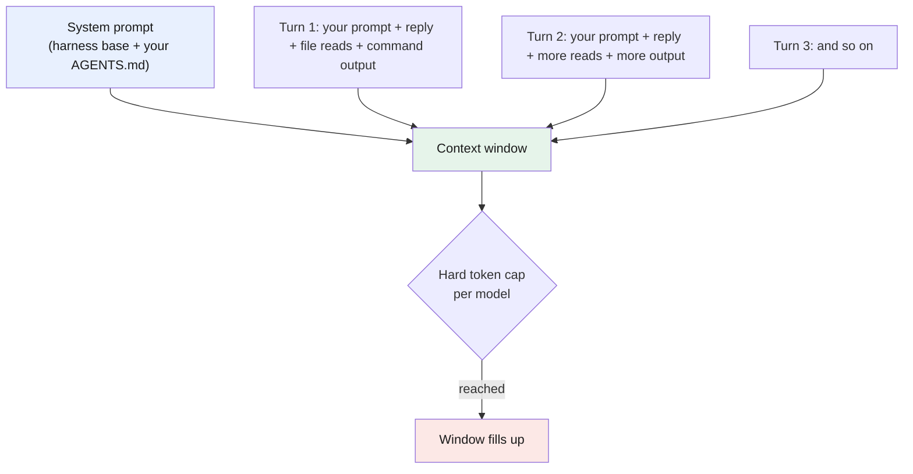

# Part 4 — The context window

> **Goal:** see how the [context window](../glossary.md#context-window) fills up turn by turn, why a nearly full window makes the model drift, and the two habits that keep it lean — compaction and pre-loaded snapshots.
> opencode compaction behavior verified against the [config doc](https://opencode.ai/docs/config/) and the [TUI commands doc](https://opencode.ai/docs/tui/).

## What the context window actually holds

The [context window](../glossary.md#context-window) is the model's only memory for a session. The model has no hidden memory between turns — on every call, the harness re-sends the whole conversation so far. That whole package is the context window, and it grows on every turn.

A turn is not just your message and the reply. Each turn can also carry tool results: the contents of every file the model read, and the full output of every command it ran. Those fill the window fast.



Three things follow from this, and they shape the rest of the guide:

- **It is resent in full every call.** There is no "the model remembers." The window *is* the memory, so a long session costs more on every turn — you pay for all of it again each time (see [Part 2](../02-deepseek/README.md) on cost).
- **It has a hard cap.** Each model has a maximum (DeepSeek-V4 Flash, for example, advertises a 1M-[token](../glossary.md#tokens) window). When you hit it, the window can no longer hold everything — the oldest content must be dropped or summarized.
- **Your rules live at the top.** The [system prompt](../glossary.md#system-prompt) — your `AGENTS.md` plus the harness base — sits at the start of the window. It is always there, but it is not immune to being crowded out (next section).

> **Mechanism in one line:** the context window is the full conversation resent on every call; it starts with your rules and grows by every message and tool result, until it hits the model's cap.

## Why a full window hurts

As the window fills, the model pays less attention to the instructions already in it — including the `AGENTS.md` rules sitting at the top. In real use, once the window is about **90% full**, the model starts to drift: it ignores a rule, calls the wrong tool, or states something false with full confidence (a [hallucination](../glossary.md#hallucination)).

> **Mechanism in one line:** a model does not read the whole window with equal care — as the window fills, the rules at the top lose weight, so the model drifts and invents more.

This is not a setting you can turn off. It is a side effect of how attention spreads over a long input. The only fix is to keep the window lean.

## Habit 1: compact between tasks

**Compaction** summarizes the older part of the session into a short checkpoint and drops the raw messages, freeing space. It is **lossy** — detail is lost — so the right moment is the boundary between two tasks, not the middle of one.

opencode compacts **automatically by default** (`compaction.auto: true`), but only **when the context is full** — that is, at 100%, already past the ~90% zone where quality drops. By the time it fires, you have already been working in the degraded range. That is why auto-compact feels unreliable in practice: it reacts too late. The fix is to compact yourself, at the right moment:

- **After each completed task** — especially a big one — run `/compact` (alias `/summarize`) before you start the next. The finished task's full tool output is no longer useful; a summary is enough.
- **Before the window gets near 90%**, not after.

You can tune the behavior in `opencode.jsonc`:

```jsonc
{
  "$schema": "https://opencode.ai/config.json",
  "compaction": {
    "auto": true,        // compact automatically when full (default)
    "prune": true,       // also drop old tool outputs to save tokens
    "reserved": 10000    // keep this many tokens free during compaction
  }
}
```

> `prune: true` is worth turning on: much of the window is stale command output and old file reads that you will never need verbatim again.

## Habit 2: fill the window with snapshots, not searching

This matters more than compaction. Every time the model has to *find out* something — scan the codebase for a convention, fetch a doc page from the web, read five files to learn the build command — it fills a large part of the window with tool output you usually do not need again. Do that a few times and the window is full of search results instead of your actual work.

`AGENTS.md` and skills cut this down. They put the knowledge the model needs **into the context up front**, as a short, stable block, so the model does not have to go find it:

- **`AGENTS.md`** states your build command, your conventions, and your review rules — once. The model reads them from the system prompt instead of grepping the repo to guess them. (See [Part 5](../05-agents-md/README.md).)
- **A skill** is a packet of instructions the model loads only when it needs that topic — so it does not fetch an external doc or re-derive a workflow each time. (See [Part 6](../06-skills/README.md).)

> **Mechanism in one line:** a rule or skill is a pre-loaded snapshot — a few hundred tokens once, instead of thousands of tokens of searching every time the model needs that knowledge.

Think of it as caching. The model will need your conventions either way. Writing them down once in `AGENTS.md` is far cheaper — in tokens, in cost, and in window space — than letting the model rediscover them on every session.

---

## Cheat-sheet

**Do**
- Run `/compact` after each completed task, before the next — do not wait for auto-compact.
- Turn on `compaction.prune` to drop stale tool output.
- Put stable knowledge (build command, conventions, workflows) in `AGENTS.md` and skills so the model reads it instead of searching for it.

**Don't**
- Don't keep one session running across many unrelated tasks — the window only fills.
- Don't rely on auto-compact alone; it fires at 100%, past the point quality already dropped.
- Don't let the model re-derive knowledge you could have written down once.

**One snippet** — the two habits in one line:
> Compact between tasks, and fill the window with your own snapshots — so the model spends its context on your work, not on searching.

---

[← Part 3: Start coding with opencode](../03-start-coding/README.md) · [↑ Index](../README.md) · [→ Part 5: AGENTS.md as system instruction](../05-agents-md/README.md)
