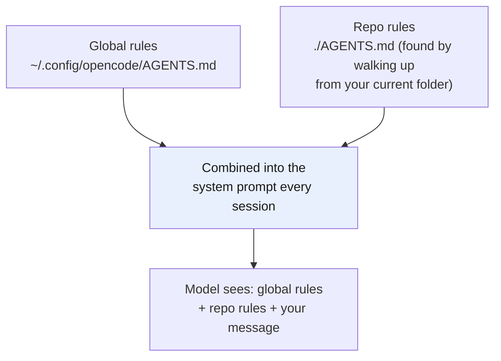

# Part 5 — AGENTS.md as system instruction

> **Goal:** use `AGENTS.md` to make the model follow *your* solution — and keep that
> control even when you swap models.
> Behavior verified against the [opencode rules doc](https://opencode.ai/en/docs/rules/).

## The goal of AGENTS.md

`AGENTS.md` is a markdown file of instructions that opencode loads into the model's context on every session. It becomes part of the [system prompt](../glossary.md#system-prompt) — the layer that shapes every reply *before* your message is seen.

Two principles make it worth writing carefully:

1. **Do not repeat yourself.** Don't put task-specific steps here ("add field X to table Y"). Put standing rules the model should always follow ("never edit migration files; generate a new one"). Tasks go in your chat prompt; rules go in `AGENTS.md`.
2. **Stay model-independent.** Write rules as *behavior*, not as model tricks. "Run tests before saying a change is done" works on DeepSeek, Claude, or GPT alike. That way you can swap the brain (Part 2) without rewriting your rules.

> **Mechanism in one line:** the model is probabilistic and will drift toward whatever is easiest; `AGENTS.md` is the fixed set of constraints that pulls it back to your way on every turn.

## How opencode loads it

opencode discovers rules files and **combines** them — they do not overwrite each other.



| Scope | File path | Use it for |
|---|---|---|
| **Global** | `~/.config/opencode/AGENTS.md` | Rules that apply to *every* project — your general coding standards, your review habits. |
| **Per-repo** | `AGENTS.md` at the repo root | Rules specific to *this* project — its build commands, architecture, conventions. |

Discovery, in plain terms (see the [rules doc](https://opencode.ai/en/docs/rules/) for the precise order):

- opencode walks **up** from your current folder to find a repo-level `AGENTS.md`.
- It always also loads the **global** `~/.config/opencode/AGENTS.md`.
- Both are **combined** and added to the model's context.
- (If you also have a `CLAUDE.md` from Claude Code, opencode reads it as a compatibility fallback — but only when no local `AGENTS.md` is found. Turn this off with `export OPENCODE_DISABLE_CLAUDE_CODE=1`.)

> One caveat: there have been reports that profile-specific or config-dir `AGENTS.md` files are sometimes ignored. Keep your global file at the documented path `~/.config/opencode/AGENTS.md` to be safe.

## Global rules — your standing standards

This is where you put the rules you want on *every* job. Two or three good ones are worth more than a wall of text. Examples of the kind of rule that belongs here:

```markdown
# Global AGENTS.md

## Git safety
- Never run `git push`. If a branch needs to reach the remote, print the exact
  `git push ...` command for me to run.
- Never stage files yourself. Leave the index untouched; print the `git add ...`
  command instead.

## Verification
- Run the relevant tests immediately after editing any file. Do not claim a task
  is done until tests pass.
- Before deleting or overwriting a file, read it first and tell me what it contains.
```

Notice these are **behaviors**, not model-specific. They work the same on any LLM. That is the test for a good global rule: *would this still be true if I changed models tomorrow?*

## Per-repo rules — what is special about this project

Every repo has things that are not obvious from the code: the real build command, the architecture decisions, the conventions a new contributor must follow. Put those in the repo's own `AGENTS.md`.

The fastest way to start is opencode's `/init` command. Run it once in a project and it scans the repo, then **creates or improves** an `AGENTS.md` in place (it will not blindly replace an existing one). Then you edit the result to match reality.

> **See this repo's own [`AGENTS.md`](../AGENTS.md)** — it is a real, working example: it states the audience, the writing rules, and the structure of this guide. That is exactly what a per-repo `AGENTS.md` is for.

## How much to write

Less than you think. A few sharp rules beat a long document nobody (including the model) reads:

- Lead with the rules you find yourself repeating in chat. If you type "run tests before saying done" three times, it belongs in `AGENTS.md`.
- Write **do/don't** pairs. The model follows "never edit migrations; create a new one" better than a paragraph explaining migration philosophy.
- Keep it short enough that the whole file is useful context, not noise that eats your [context window](../glossary.md#context-window) for no gain.

> `AGENTS.md` is not done when you write it. As you use it, you will find gaps and
> loopholes. That is normal — see [Part 8: the feedback loop](../08-feedback-loop/README.md)
> for how to keep it sharp over time, using the agent itself to update it.

---

## Cheat-sheet

**Do**
- Put standing rules in `AGENTS.md`, not one-off tasks.
- Write model-independent behavior rules ("run tests first"), not model tricks.
- Global = your standards; repo = that project's specifics. They combine.

**Don't**
- Don't dump everything into one file — split when it nears the cap.
- Don't expect the model to remember between sessions; `AGENTS.md` is how it "remembers."

**One snippet** — the test for a good rule:
> If you swapped the model tomorrow, would this rule still be true? If yes, it belongs in `AGENTS.md`.

---

[← Part 4: The context window](../04-context-window/README.md) · [↑ Index](../README.md) · [→ Part 6: Agent skills](../06-skills/README.md)
