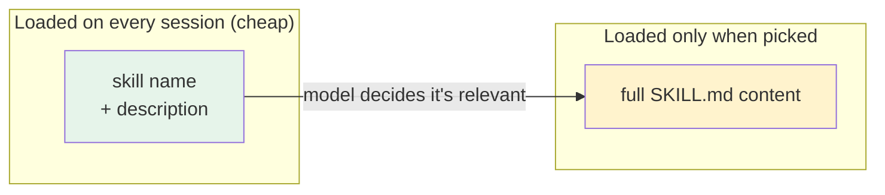

# Part 5 — Agent skills

> **Goal:** package knowledge, workflows, and tools as **skills** the agent can load
> on demand — cheaply, and often instead of building an MCP.
> **As of 2026-07.** Behavior verified against the [opencode skills doc](https://opencode.ai/en/docs/skills/).

## The goal of a skill

A **[skill](../glossary.md#skill)** is a reusable packet of instructions that opencode can load into the model's context when it is relevant. It lives in a folder with a `SKILL.md` file.

The key idea — and the reason skills matter — is **lazy loading**:

- opencode only ever loads each skill's **name + description** up front. That costs almost nothing in your [context window](../glossary.md#context-window).
- When the model decides a skill is relevant, it loads the **full content** — and only then.



### Why this beats loading everything

If you put all your instructions directly in `AGENTS.md`, they are loaded on *every* turn — using context even when not relevant. Skills solve this: ten skills cost you only ten short descriptions until one is actually needed.

This is also why **a skill is often a better choice than an [MCP](../glossary.md#mcp) server** (see [Part 6](../06-mcp/README.md)). An MCP server typically exposes its full tool list to the model up front, which uses more context. A skill costs only its name and description until used.

## The three kinds of skill

A skill is just instructions, so it can be any of these:

| Kind | What it holds | Example |
|---|---|---|
| **Knowledge** | Facts the model should know to work in your project. | "Our error format is `{code, message}`; here is the list of codes." |
| **Workflow** | A repeatable procedure. | "Code review steps: read diff, check tests pass, verify naming, report." |
| **Tool** | How to call an external command or CLI. | "Manage todos by running `todo add` / `todo done` with these args." |

## How to create a skill

A skill is a folder named after the skill, containing a `SKILL.md`. The file starts with YAML **frontmatter** with two required fields:

```markdown
---
name: code-review
description: Review a git diff for quality. Use when the user asks to review
  changes, check a PR, or run a code review before commit.
---

## What I do
- Read the diff and check that tests pass.
- Verify naming and that no files outside scope were touched.
- Report findings as a short list: blocker / should-fix / nitpick.

## When to use me
Use this when the user wants a review of recent changes before they are committed.
```

The single most important field is **`description`**. Why: the model uses *only* the description to decide whether to load the skill. If the description is vague, the skill never gets picked. Make it specific — say what it does and when to use it.

Rules for the folder and frontmatter (from the skills doc):

- The folder name **must match** the `name` field exactly.
- `name`: 1–64 chars, lowercase letters/numbers, single hyphens, no leading/trailing hyphen, no `--`.
- `description`: 1–1024 chars, plain text describing what it does and when to use it.

### Where skills live

opencode searches several locations, global and per-repo:

| Scope | Path |
|---|---|
| **Per-repo** | `.opencode/skills/<name>/SKILL.md` |
| **Per-repo (compat)** | `.agents/skills/<name>/SKILL.md` or `.claude/skills/<name>/SKILL.md` |
| **Global** | `~/.config/opencode/skills/<name>/SKILL.md` |
| **Global (compat)** | `~/.agents/skills/<name>/SKILL.md` or `~/.claude/skills/<name>/SKILL.md` |

Use **global** for skills you want on every project (your personal review workflow, your todo tool). Use **per-repo** for skills specific to one codebase.

## How to use a skill

There are two ways a skill gets activated:

1. **Auto-pick (the default).** opencode lists available skills (name + description) in the skill tool's description. When your request matches a skill's description, the model loads it and follows it. This is convenient — but it is not guaranteed; the model may not pick it every time.
2. **Manual invoke.** You can tell the model directly: *"use the code-review skill."* Use this when auto-pick did not happen and you know which skill you want.

> **Tip:** if a skill is not getting auto-picked, the fix is almost always a more specific `description` — say clearly *when* to use it.

> A skill's content will also go stale or show loopholes as you use it. That is normal —
> see [Part 7: the feedback loop](../07-feedback-loop/README.md) for how to keep skills
> sharp over time, using the agent itself to update them.

---

## Cheat-sheet

**Do**
- Make `description` specific — it is the only thing the model uses to pick the skill.
- Prefer skills over MCP when you can (lazy loading vs always-loaded tool list).
- Use global for your standard workflows; per-repo for project specifics.

**Don't**
- Don't dump instructions into `AGENTS.md` if they are only sometimes relevant — make a skill.
- Don't expect auto-pick to be 100% reliable; manual invoke is always available.

**One snippet** — the decision in one line:
> Lazy-loaded (skill) when you can; always-on (MCP) only when you must.

---

[← Part 4: AGENTS.md as system instruction](../04-agents-md/README.md) · [↑ Index](../README.md) · [→ Part 6: MCP — when to use it](../06-mcp/README.md)
