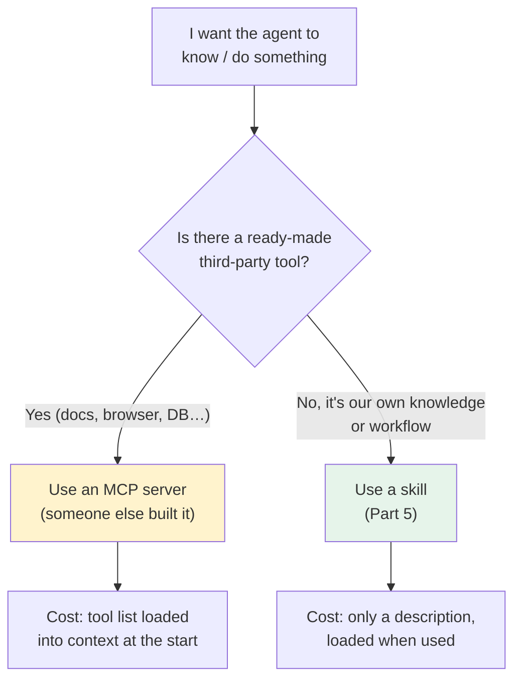

# Part 6 — MCP, when to use it

> **Goal:** know what [MCP](../glossary.md#mcp) is for, when to use it, and why
> a [skill](../glossary.md#skill) is usually the better choice when you just need to
> teach the agent something.
> **As of 2026-07.** Config syntax verified against the [opencode MCP doc](https://opencode.ai/en/docs/mcp-servers/).

## What MCP is for

**MCP** (Model Context Protocol) is a standard way to plug **external data or tools** into your harness. Think of it as a socket: someone builds an MCP server for a service, and any harness that speaks MCP (opencode, Claude Code, others) can use it.

The reason it exists: you should not have to copy-paste a database row, a live web page, or a browser's console into the chat by hand. An MCP server lets the model fetch that data or drive that tool itself, on demand.

Two good, ready-made examples worth knowing:

| MCP server | What it gives the model | Link |
|---|---|---|
| **Context7** | Up-to-date docs for any library, fetched live so the model does not rely on stale memory. | <https://context7.com/> |
| **Chrome DevTools MCP** | Control a real browser — navigate, click, read the console, inspect a page. | <https://github.com/ChromeDevTools/chrome-devtools-mcp> |

## The honest stance: skill first, MCP when you must

Building your *own* MCP server is hard. You have to write a server, handle the protocol, manage a process, and keep it running. For most "teach the agent how we do X" needs, that is far more work than the task needs.



**Simple guide:**

- **Use an MCP server** when a third party already built the tool you need (live docs, a browser, a database, an external API). You get real capability without writing the hard part.
- **Use a skill** when the thing you want to teach is *your own* knowledge, workflow, or a simple CLI call. A skill is just a markdown file (see [Part 5](../05-skills/README.md)) — no server, no protocol, no process to run.

## How to add an MCP server in opencode

MCP servers go in the `mcp` block of your `opencode.jsonc`. There are two types:

- **`local`** — runs a command on your machine. Pass secrets via `environment`.
- **`remote`** — points at a URL. Pass secrets via `headers`, using `"{env:VAR}"` so the key is read from your environment and never written into the file.

```jsonc
{
  "$schema": "https://opencode.ai/config.json",
  "mcp": {
    // remote example: live library docs
    "context7": {
      "type": "remote",
      "url": "https://mcp.context7.com/mcp",
      "headers": {
        "Authorization": "Bearer {env:CONTEXT7_API_KEY}"
      }
    },
    // local example: a command-based server
    "my-local-tool": {
      "type": "local",
      "command": ["npx", "-y", "some-mcp-server"],
      "enabled": true,
      "environment": {
        "MY_API_KEY": "{env:MY_API_KEY}"
      }
    }
  }
}
```

Set `"enabled": false` to turn a server off temporarily without removing it from the file.

> **Full MCP config reference:** <https://opencode.ai/en/docs/mcp-servers/>

## Keep it lean

Every MCP server you enable adds its tool list to what the model sees at the start. Add only the servers you actually use on a project. If a server's tools are only sometimes relevant, ask whether a skill (Part 5) could cover the common case instead.

---

## Cheat-sheet

**Do**
- Use an MCP server for real third-party tools (docs, browser, database, external APIs).
- Pass secrets with `"{env:VAR}"` — never hardcode keys in the config.
- Disable unused servers (`"enabled": false`) instead of deleting them.

**Don't**
- Don't build your own MCP server to teach project knowledge — write a skill instead.
- Don't enable every MCP server you find; each one costs context.

**One snippet** — the decision in one line:
> Use a tool someone else built (MCP); teach your own way with a file (skill).

---

[← Part 5: Agent skills](../05-skills/README.md) · [↑ Index](../README.md) · [→ Part 7: The feedback loop](../07-feedback-loop/README.md)
