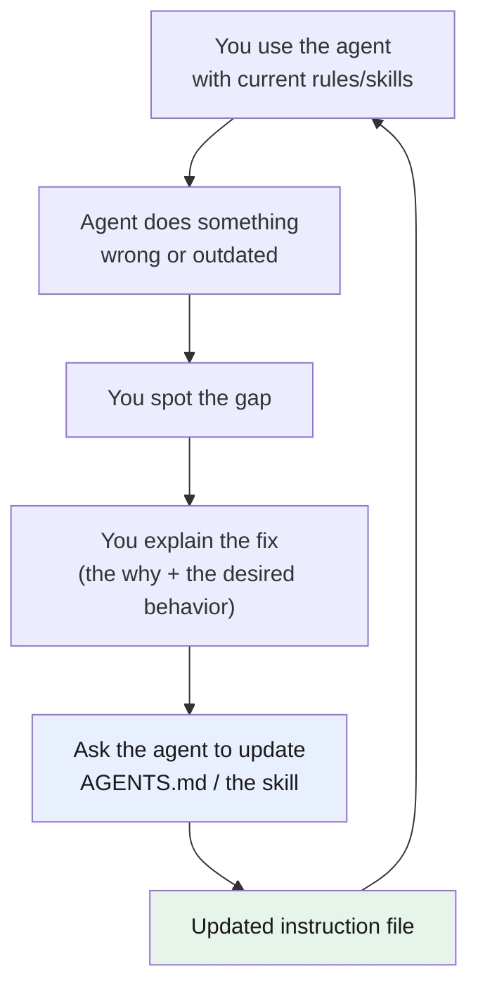

# Part 8 — The feedback loop: keep your instructions sharp

> **Goal:** treat `AGENTS.md` and your [skills](../glossary.md#skill) as living files
> that get better over time — and use the agent itself to update them.
> **Applies to:** [Part 5 (AGENTS.md)](../05-agents-md/README.md) and [Part 6 (skills)](../06-skills/README.md).

## The core idea

You wrote your [AGENTS.md](../05-agents-md/README.md) and your skills. They are not
done. They are **living files** — like code, not like a printed manual.

Why: the model is probabilistic, so even with good instructions it will sometimes do
the wrong thing — skip a step, use an old pattern, miss a case. Each time that
happens, you have found a **gap** in your instructions. The loop is: catch the gap,
explain the fix, and **ask the agent to update the instruction file itself** so the
same gap never happens again.

> **Mechanism in one line:** every mistake is information about a hole in your
> instructions; closing that hole makes the next session better, automatically.

## The loop

Four steps, repeated:

1. **Spot the gap.** The agent skips a test, edits a file you wanted read-only, uses a
   deprecated API, or a skill's knowledge is now wrong.
2. **Explain the fix.** Say *what* was wrong and *what you wanted instead*. The "why"
   matters — it lets the agent write a sharper rule than if it just copied your words exactly.
3. **Ask the agent to update the file.** Literally: *"From what you just learned,
   update the skill / AGENTS.md so this does not happen again."*
4. **Review the change.** The agent edits the file. You read the diff like any other
   code change (see [Part 1](../01-opencode/README.md#what-does-not-change)). Approve,
   or adjust.

## Two real examples

**Knowledge skill gone stale.** A skill documents your API error codes. A new code
ships in the real API. The agent gives advice using the old list. You point out the
new code, then: *"Update the error-codes skill with this new code and its meaning."*
Next time, the skill is correct.

**AGENTS.md loophole.** Your rules say "never edit migration files." But the agent
edits the seed file instead, which is just as dangerous. You realize the rule was too
narrow. You explain: *"Seed files are also generated-only; treat them like
migrations."* Then: *"Update AGENTS.md so the rule covers both migrations and seed
files."* The loophole is closed permanently.

## Why this beats rewriting rules yourself

You *could* open the file and type the fix. But asking the agent has two advantages:

- **It sees the full context.** The agent knows which rule was too narrow and where it
  lives in the file, so it updates the right spot instead of you having to find the right place yourself.
- **It keeps the file's voice and structure.** The agent matches the existing style,
  so your instructions stay consistent rather than written in several different styles.

You still own the review — the agent proposes, you approve. That is the same division
as the rest of this guide.

## The habit that makes it work

The loop only helps if you actually run it. The trigger is simple: **any time you
repeat yourself to correct the agent, that correction belongs in a file.**

- If you correct the same thing twice → it is a standing rule → put it in `AGENTS.md`.
- If you correct something specific to a workflow or knowledge area → it belongs in a skill.

A few weeks of this and your instructions become much better — because every gap was found in real use and then closed.

---

## Cheat-sheet

**Do**
- Treat `AGENTS.md` and skills as living code, not one-time writing.
- Ask the agent to update the instruction file after you explain a fix.
- Review the file diff before accepting, like any code change.

**Don't**
- Don't manually retype the same correction every session — move it into a file.
- Don't accept the agent's file edit blindly; read what it actually changed.

**One snippet** — the trigger to remember:
> If you corrected it twice, it is no longer a chat instruction — move it into a file.

---

[← Part 7: MCP — when to use it](../07-mcp/README.md) · [↑ Index](../README.md) · [→ Part 9: pi.dev: a leaner harness](../09-pi/README.md)
