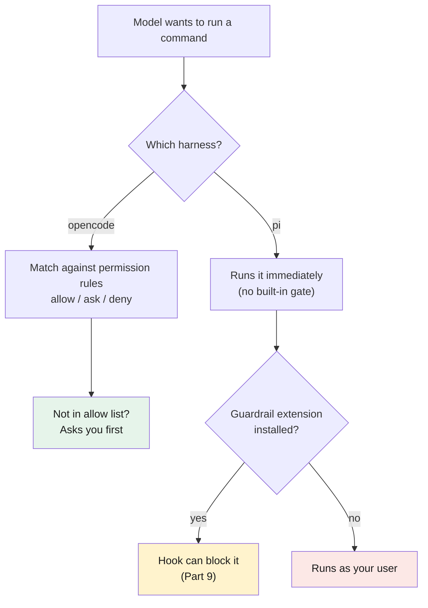

# Part 8 — pi.dev: a leaner harness

> **Goal:** meet **pi** as a second harness, see how its trade-offs differ from
> opencode, and learn the two practices that keep a harness with *no permission
> system* safe to run.
> Behavior verified against pi's own docs (home: <https://pi.dev>). pi ships fast —
> verify specifics before relying on them.

## Meet pi

**pi** is a minimal terminal coding harness. Its rule is the opposite of opencode's:
it keeps a tiny core and asks you to add everything else yourself. From pi's own
philosophy page: it "skips features like sub agents and plan mode" on purpose, because
you can build any of them — or install a package someone else built.

That makes pi the lean end of the harness spectrum. Less is built in; more is up to you.

## How pi differs from opencode

You already know a harness from [Part 1](../01-opencode/README.md). Here is the honest
side-by-side. Both are harnesses; the differences are in what they ship by default.

| Area | opencode | pi |
|---|---|---|
| **Permission system** | Built in. `allow` / `ask` / `deny` rules in config. | **None.** Every tool call runs without asking. |
| **MCP** | Built in. Add servers in config. | Not built in. Add via an extension. |
| **Sub-agents** | Built in. | Not built in. Add via an extension. |
| **Extensions / hooks** | Plugins and hooks exist. | The *core* design. Granular event system (see [Part 9](../09-extending-pi/README.md)). |
| **Skills** | Yes ([Part 5](../05-skills/README.md)). | Yes — same Agent Skills standard. |
| **`AGENTS.md`** | Loaded per [Part 4](../04-agents-md/README.md). | Loaded too. Your rules transfer. |
| **Model choice** | Bring your own. | Bring your own. DeepSeek works in both. |

> **Mechanism in one line:** opencode's safety is *config* (you write rules); pi's is
> *code* (you write an extension). opencode asks before new actions; pi runs them.

### What transfers directly

Good news: most of this guide carries over to pi unchanged.

- **The harness-vs-model split** ([Part 1](../01-opencode/README.md#harness-vs-model--do-not-confuse-them)) is identical.
- **`AGENTS.md`** ([Part 4](../04-agents-md/README.md)) — pi loads `~/.pi/agent/AGENTS.md`, walks up from your folder, and combines them. Same idea, same file.
- **Skills** ([Part 5](../05-skills/README.md)) — pi uses the same skill folders and format.
- **DeepSeek for the loop** ([Part 2](../02-deepseek/README.md)) — pi supports the DeepSeek API, so your cheap-model-for-the-loop habit still applies.

## The trade-off: no permission system

This is the one difference you must take seriously. From pi's security doc: pi "does
not include a built-in sandbox," and its tools "can read files, write files, edit files,
and run shell commands with the permissions of the pi process." There is no `ask` step.



It is fast, and it is dangerous. The model can run any command you could run. For real
isolation, pi's own advice is to run the whole process in a container or VM — an
in-process check is not a security boundary. The two practices below are the lighter,
daily habits that make plain local use safer.

## Practice 1: keep the context window lean

> **Mechanism in one line:** when the [context window](../glossary.md#context-window)
> is nearly full, the model pays less attention to the instructions already in it — so it is
> more likely to drift and call the wrong tool.

A practical limit from real use: once the window is about **90% full**, mistakes and
unexpected tool calls rise. The fix is to treat context like a resource you manage, not
a limitless space.

pi helps you do this:

- **Watch the footer.** pi shows live **context usage** in the footer (along with token
  and cost totals). Glance at it the way you glance at disk space.
- **Compact before it gets full.** pi has **compaction** — it summarizes older messages
  to free space. It runs automatically when context overflows, and you can trigger it
  any time with `/compact`. Compacting earlier (around 80–85%) keeps the model following your rules.

If you want to see context from your own code, an extension can read it too — see
[Part 9](../09-extending-pi/README.md).

## Practice 2: add guardrails

Since pi has no built-in gate, add one as an extension. The recommended one is
**[pi-guardrails](https://github.com/aliou/pi-guardrails)** — "Security hooks for Pi.
Prevents dangerous operations, protects env files, gates destructive commands."

It is a pi extension that uses the `tool_call` hook (explained in
[Part 9](../09-extending-pi/README.md)) to block destructive commands, stop writes to
`.env` and similar files, and keep paths inside your workspace. Install it with pi's
package command:

```bash
pi install git:github.com/aliou/pi-guardrails
```

> Be honest about what this is and is not. A guardrail extension catches the common,
> dangerous cases. It is not a sandbox — a clever prompt or a determined model can still
> get around it. It is "much better than nothing," not "perfectly safe." Combine it with
> a container when the work is risky or unattended.

---

## Cheat-sheet

**Do**
- Treat pi's lack of a permission system as real risk, not a convenience.
- Watch context usage in the footer; `/compact` before it hits ~90%.
- Install a guardrail extension for daily use; use a container for risky or unattended work.

**Don't**
- Don't expect pi to ask before a dangerous command — it will not.
- Don't fill the context window to the top and hope the model still follows your rules.

**One snippet** — the two daily habits in one line:
> Keep context lean (watch the footer, `/compact` early) and add a guardrail — because pi will never ask for you.

---

[← Part 7: The feedback loop](../07-feedback-loop/README.md) · [↑ Index](../README.md) · [→ Part 9: Extending pi](../09-extending-pi/README.md)
