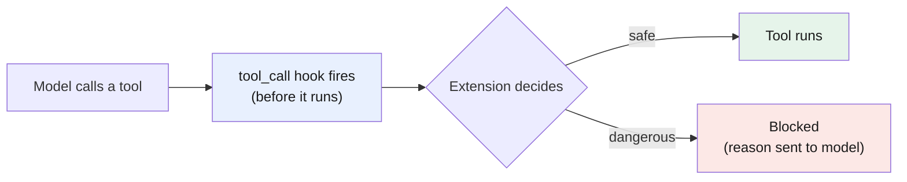

# Part 9 — Extending pi: extensions and the ecosystem

> **Goal:** understand why **extensions** are pi's defining feature, see how **hooks**
> let you rebuild anything pi lacks, and learn the community packages that fill pi's
> gaps (MCP, sub-agents, remote access).
> Behavior verified against pi's [extensions doc](https://pi.dev/docs/latest/extensions).

## pi ships little, extends far

In [Part 8](../08-pi/README.md) you saw what pi leaves out: a permission system, native
MCP, native sub-agents. None of that is missing by accident. pi's design is a small core
plus a deep extension system. What other harnesses bake in, you add to pi — as code.

That is the trade-off, stated plainly: pi gives you more control and more flexibility, at
the cost of doing more setup yourself.

## What an extension is

An **[extension](../glossary.md#extension)** is a TypeScript module pi loads. It can:

- register **custom tools** the model can call,
- register **commands** (the `/name` shortcuts),
- add **UI** (status lines, widgets, overlays),
- subscribe to **[hooks](../glossary.md#hook)** — events that fire as pi works.

You write TypeScript directly; pi loads it without a build step. A minimal extension is
one file in `~/.pi/agent/extensions/`. This is also how a
[skill](../glossary.md#skill) differs from an extension: a skill is instructions
(markdown); an extension is running code.

## Hooks: pi's granular event system

A **[hook](../glossary.md#hook)** is a named point where your code runs and can change
what happens. pi exposes a fine-grained lifecycle. The two that matter most for control:

- **`tool_call`** — fires *before* a tool runs, and **can block it**. This is exactly how
  [pi-guardrails](https://github.com/aliou/pi-guardrails) (Part 8) stops dangerous commands.
- **`tool_result`** — fires *after* a tool runs, and **can modify the result**.



Beyond these, hooks let you inject or rewrite the
[system prompt](../glossary.md#system-prompt) (`before_agent_start`), change the messages
the model sees (`context`), customize compaction, and more. pi's own docs list what
extensions can build: permission gates, path protection, plan mode, sub-agents, MCP
support, git auto-commit — all as extensions.

> **The opencode contrast:** opencode's safety is *config* (you write `allow`/`ask`/`deny`
> rules, [Part 3](../03-start-coding/README.md)). pi's is *code* (you write a hook). Config
> is faster to start with; code is more flexible. Pick the style that fits your project.

## Ask pi to build it

You do not have to write extensions from scratch. pi's docs say plainly: "pi can
create extensions. Ask it to build one for your use case." Because pi can read its own
documentation, the usual workflow is: describe the gap, and let pi draft the extension.
Then you review the code like any other change (see [Part 1](../01-opencode/README.md#what-does-not-change)).

## The ecosystem: filling pi's gaps

pi intentionally has no native MCP and no native sub-agents. The community ships both as
extensions, plus tools for remote work. Install any of them with `pi install`:

| Package | What it adds | Link |
|---|---|---|
| **pi-mcp-adapter** | [MCP](../glossary.md#mcp) support. Token-efficient: it proxies many MCP tools through one compact tool, so the full tool list does not bloat your context (ties to [Practice 1](../08-pi/README.md#practice-1-keep-the-context-window-lean)). | <https://github.com/nicobailon/pi-mcp-adapter> |
| **pi-subagents** | Delegate work to focused child agents — code review, scouting a codebase, parallel audits, saved workflows. | <https://github.com/nicobailon/pi-subagents> |
| **pi-telegram** | Turn a private Telegram DM into a remote surface for pi. Start work at your desk, then keep driving it from your phone when you step away. | <https://github.com/llblab/pi-telegram> |

Install from git (the form matches the links above):

```bash
pi install git:github.com/nicobailon/pi-mcp-adapter
pi install git:github.com/nicobailon/pi-subagents
pi install git:github.com/llblab/pi-telegram
```

> **Security:** pi packages run with your full permissions — extensions are arbitrary
> code. Read the source before you install a third-party package, the same caution as any
> `npm install`. Start with the popular, well-reviewed ones.

---

## Cheat-sheet

**Do**
- Reach for an extension when pi lacks a feature — that is how pi is meant to be used.
- Use the `tool_call` hook to block dangerous actions (or install one that does).
- Let pi draft an extension from its own docs, then review the code.

**Don't**
- Don't install third-party extensions without reading their source.
- Don't confuse a hook-based guardrail with a real sandbox — combine with a container for risky work.

**One snippet** — the pi design rule in one line:
> Minimal core, deep hooks: anything pi lacks, an extension can add.

---

[← Part 8: pi.dev: a leaner harness](../08-pi/README.md) · [↑ Index](../README.md)
