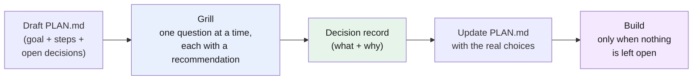

# Part 11 — Plan and grill: decide before you build

> **Goal:** write the plan to a file before you drive the agent, then let the agent grill the open decisions one at a time — so it builds the right thing the first time.
> **Part of:** the workflows group (Parts 11–13). Builds on [Part 4 (context window)](../04-context-window/README.md) and [Part 6 (skills)](../06-skills/README.md).

Parts 1 to 10 covered what you work with — the harness, the model, your rules, your skills. Parts 11 to 13 are **workflows**: disciplined ways to use them on a real task.

## Why plan in a file, not in the chat

Two problems appear when you plan only inside the chat:

1. **The plan lives in the context window**, so it drifts as the window fills (see [Part 4](../04-context-window/README.md)) and it is gone when the session ends.
2. **You cannot review the whole approach at once.** A plan spread across many chat messages is hard to hold in your head, so you miss gaps until the agent has already built the wrong thing.

The fix is a [plan file](../glossary.md#plan-file) — usually `PLAN.md`. It is a [snapshot](../04-context-window/README.md): a short, stable block the agent reads on every turn, and that you can read top-to-bottom as one unit.

> **Mechanism in one line:** a plan file moves your intent out of the volatile chat and into a file you both read — so the goal stays fixed and the approach is reviewable.

## What goes in a plan file

Keep it short. The plan is a contract between you and the agent for this one task:

```markdown
# Plan: add CSV export to the report page

## Goal
Let a user download the current report as CSV.

## In scope
- "Export CSV" button on the report page
- Reuse the existing report query

## Out of scope
- Other formats (PDF, XLSX)
- Scheduling and email delivery

## Steps
1. Add the button to the report view
2. Add a CSV endpoint next to the report endpoint
3. Add a test that the CSV matches the on-screen rows

## Open decisions
- Comma separator: "," (recommended — most tools support it)

## Risks
- Large reports: stream the response instead of building it in memory
```

Three parts do the most work: **Out of scope** (stops the agent from building more than you asked for), **Steps in order** (gives the agent a path), and **Open decisions** (the things you have not chosen yet — which is what grilling is for).

## Grill the plan before you build

A plan with open decisions is not ready. **Grilling** closes them — slowly, one at a time. The agent asks you one question, with its recommended answer; you answer; it asks the next. It works through the decision tree one branch at a time, resolving each choice before the one that depends on it.

Two rules make grilling work:

- **One question at a time.** A list of ten questions at once is hard to answer well; you answer each without real thought. One at a time forces a real answer to each.
- **Every question comes with a recommended answer.** It is faster for you to confirm or correct a suggestion than to invent an answer from nothing — and your correction exposes your real preference.

> **Mechanism in one line:** one question at a time, each with a recommended answer, turns a vague plan into a list of settled decisions — each one recorded, not lost.

Facts and decisions are treated differently. If the answer can be found by reading the code or a doc, the agent looks it up — it does not ask you. The **decisions** are yours: the agent puts each one to you and waits.

> **Use the real skill.** Grilling is also a ready-made skill you can add to your harness so the agent runs it on demand: [grilling skill](https://github.com/mattpocock/skills/blob/main/skills/productivity/grilling/SKILL.md). See [Part 6](../06-skills/README.md) for how skills load.

### What you get out of it

The grilling is slow, and that is the point. By the end:

- Every open decision is settled, and the settled choices become a **[decision record](../glossary.md#decision-record)** — a short note of what was decided and why, that you can reload next time.
- The plan file is updated with the real choices, so the agent builds the right thing.



## When to grill, and when not to

Grilling costs time, so spend it where the cost of being wrong is high.

- **Grill** a new feature, an architecture choice, a data model, a refactor that touches many files.
- **Skip** a one-line fix, a rename, a task where the right answer is obvious. Write a one-line plan and build.

This is the same trade-off as [skills](../06-skills/README.md): spend the setup time when the task is complex enough to need it.

---

## Cheat-sheet

**Do**
- Write `PLAN.md` before you drive the agent — goal, out-of-scope, ordered steps, open decisions.
- Grill open decisions one at a time, each with a recommended answer.
- Let the agent look up facts; keep the decisions for yourself.
- Build only when no decision is left open.

**Don't**
- Don't plan only in the chat — it drifts and it ends with the session.
- Don't accept a plan you have not read top-to-bottom.
- Don't grill trivial tasks — the setup time is not worth it.

**One snippet** — the workflow in one line:
> Draft the plan in a file, grill every open decision to a record, update the plan, then build.

---

[← Part 10: Extending pi](../10-extending-pi/README.md) · [↑ Index](../README.md) · [→ Part 12: Fresh-context review](../12-workflows-fresh-context-review/README.md)
