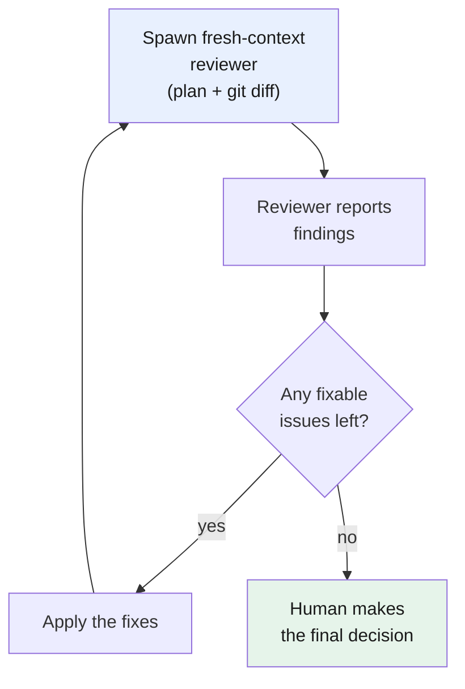

# Part 12 — Fresh-context review: check your work with a fresh window

> **Goal:** after building, spawn a subagent with a fresh context window to review the work against the plan and the diff — and loop until it finds nothing.
> **Part of:** the workflows group (Parts 11–13). Pairs with [Part 11 (plan and grill)](../11-workflows-plan-and-grill/README.md): it reviews what Part 11 planned.

## Why your own session is a bad reviewer

By the time you finish building, the main session holds every choice you made, every wrong path you tried and dropped, and every compromise you accepted. That context is useful for building — and bad for reviewing. Two things happen:

1. **You are biased toward your own approach.** You wrote the code a certain way for a reason, and that reason is still in the window. You tend to see what you meant, not what is there.
2. **The window is full.** As [Part 4](../04-context-window/README.md) showed, a full window degrades attention — right when you want the model to read hardest.

A **[fresh-context reviewer](../glossary.md#fresh-context-review)** fixes both. It is a subagent the harness spawns with an empty window. You hand it only the [plan](../11-workflows-plan-and-grill/README.md) and the code changes. It has none of your reasoning, so it judges the work as it stands, not as you intended it.

> **Mechanism in one line:** a fresh-context reviewer has no memory of how the code was built, so it sees the code the way a new reader does — which is exactly what a review needs.

## What to hand the reviewer

A review needs a clear scope to be useful. Give the reviewer two things:

1. **The spec: `PLAN.md`** (from Part 11). The reviewer checks the work *against the plan*, not against a vague "is this good?" If a step in the plan has no matching code, that is a finding.
2. **The work: the `git diff`.** The reviewer reads only what changed, so it spends its window on the new code instead of re-reading the whole repo.

```bash
git diff --staged   # review only what you are about to commit
```

So the review question is clear and specific: *does this diff do what the plan says, and is the code correct and clean?*

## The loop: review until clean

One pass is rarely enough. The reviewer finds issues; you (or the agent) fix them; the reviewer looks again. Repeat until it finds nothing fixable.



Two points about the loop:

- **The AI runs the iterations.** Spawning a fresh reviewer is cheap, so let it work: review, fix, review, fix, until it reports no more issues. This is where you save your own time.
- **The human makes the final decision.** "No fixable issues left" is not the same as "correct." Read the last diff yourself. The loop reduces the work to the few things only a human can judge.

> **Mechanism in one line:** the AI runs the cheap iterations until the reviewer reports no issues; the human decides on what remains.

## How this guide uses it

This is not theoretical. The rules file for this guide ([`AGENTS.md`](../AGENTS.md)) says: *every new part must pass an independent review before it is done, and the author does not self-approve.* Each part you have read was checked by a fresh-context reviewer against those rules. That is the workflow in this part, applied to the guide itself — including this page.

## When to use it

- **Always, before you commit a non-trivial change.** The cost is one subagent run, and it often catches a real bug.
- **Especially after a long session.** The longer you built, the more biased the main session is — and the more a fresh view is worth.

---

## Cheat-sheet

**Do**
- Spawn a fresh-context reviewer with the plan plus the staged `git diff`.
- Loop review → fix → review until the reviewer finds nothing fixable.
- Make the final decision yourself — the AI reduces the work, you decide.

**Don't**
- Don't ask the main session to review its own work — it is biased and its window is full.
- Don't review without a plan to check against — "is this good?" is too vague.
- Don't treat "reviewer reports nothing" as "done" — read the last diff.

**One snippet** — the workflow in one line:
> Hand a fresh-context reviewer the plan and the diff, loop until it reports nothing, then you make the final decision.

---

[← Part 11: Plan and grill](../11-workflows-plan-and-grill/README.md) · [↑ Index](../README.md) · [→ Part 13: Parallel workspaces](../13-workflows-parallel-workspaces/README.md)
