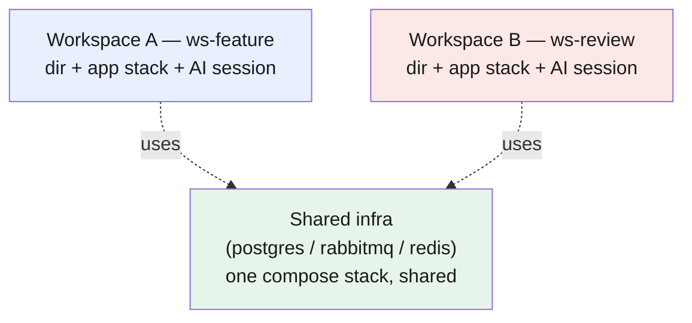

# Part 13 — Parallel workspaces: run more than one AI task at once

> **Goal:** run several AI tasks at the same time — build a feature here, review a colleague's PR there — by giving each task its own working directory, its own running app and services, and its own AI session.
> **Part of:** the workflows group (Parts 11–13). Builds on [Part 4 (context window)](../04-context-window/README.md) and [Part 5 (AGENTS.md)](../05-agents-md/README.md).

## The problem: one directory serves one task

A git working directory checks out one branch at a time. An AI session's working state — uncommitted edits, the plan it is following, the processes it started — is all in that directory. So one directory serves one task. If you switch branches in the middle of a task, you disrupt the agent.

That breaks the moment you want to do two things at once: keep building a feature while you review a teammate's PR on another branch. One directory cannot hold both.

## A workspace is directory + running stack + AI session

A **[workspace](../glossary.md#workspace)** is the unit of parallel work: a working directory, the app and services running for it, and one AI session pointed at it. Each session has its own [context window](../04-context-window/README.md), so a second task does not crowd the first. You open as many workspaces as you have parallel tasks.

The directory is the easy half. The hard half is the **running stack**. Two AI sessions that share one running app collide: the second session's restart stops the first session's process, or both bind the same port and one fails. A workspace without an isolated stack lets you edit in parallel but not **test** in parallel — you can code on two branches, but you can run and manually test only one at a time.

> **Mechanism in one line:** a [git worktree](../glossary.md#git-worktree) (or a second clone) gives you the second directory; per-workspace Docker Compose settings give the second stack its own name, network, and ports — so each task can run and test on its own.

## Where the AGENTS.md goes

The rules file belongs at the boundary the agent needs to understand.

**Monorepo (one repo, all code inside).** Put a single `AGENTS.md` at the base that says how the folders cooperate — which service talks to which, where the shared types are, how to run the tests. Each workspace is a worktree of the same monorepo, so they all read the same file.

**Many repos (micro-frontends, microservices).** Make the workspace a folder that contains the repos as **git submodules**, and put one `AGENTS.md` at the workspace root that says how the repos fit together. Pin the submodule commits in that root folder and version it. Your team clones the root folder and gets the same set of repos at the same revisions, plus the same map of how they connect.

## Isolate the running stack per workspace

This is the part that makes parallel testing work. Four habits, all harness-agnostic:

- **Put a Docker Compose file in every repo.** One command brings the app and its services up or down, and stops them cleanly. Stopping processes by PID is fragile; a compose stack stops as a unit.
- **Give each workspace a distinct project name.** Compose uses the project name to isolate environments: it prefixes every container, network, and volume with that name ([Docker docs](https://docs.docker.com/compose/how-tos/project-name/)). By default the project name is the **folder that holds the compose file**. In a monorepo that is the workspace root, so distinct workspace folders (`ws-feature`, `ws-review`) give you isolation with no extra config. In the multi-repo case the same repo folders repeat in every workspace, so set `COMPOSE_PROJECT_NAME` explicitly per workspace (for example `wsfeature`, `wsreview`) to avoid collisions.
- **Make every published port overridable by env var**, and pick a different port per workspace so the stacks can run at the same time. State the defaults and the override variable in `AGENTS.md`, or keep a short `LOCAL_PORT.md` next to the compose file — useful when you version the workspace folder for the team.
- **Run shared infrastructure once, separately.** Databases, queues, and caches (Postgres, RabbitMQ, Redis) that every workspace needs belong in their own compose stack on your machine, shared across workspaces. Only the app and its private services run in each workspace's stack.

The first three habits together, run as one command:

```sh
# workspace A — its own project name and ports
cd ws-feature && COMPOSE_PROJECT_NAME=wsfeature APP_PORT=3001 docker compose up -d
# workspace B — different name, different ports
cd ws-review   && COMPOSE_PROJECT_NAME=wsreview   APP_PORT=3002 docker compose up -d
```



## Why any harness works

Nothing here is AI-specific. A workspace is just a folder, a compose project name, and a set of ports — any AI harness pointed at the folder works, because the isolation comes from Docker and the filesystem, not the harness. You can change harnesses without changing the setup.

## Cheat-sheet

**Do**
- One workspace per parallel task — directory + running stack + one AI session.
- Put `AGENTS.md` at the boundary — base of the monorepo, or the root of the submodule folder.
- Compose in every repo; a distinct project name per workspace; overridable ports; shared infra in its own stack.

**Don't**
- Don't run two tasks in one directory — a branch switch mid-task disrupts the agent.
- Don't share one running stack between workspaces — port and process collisions stop one of them.
- Don't rely on `git worktree` alone — it gives you the second directory, not the second testable stack.

**One snippet** — the workflow in one line:
> One workspace per task — its own directory, its own compose project name, its own ports, and one AI session.

---

[← Part 12: Fresh-context review](../12-workflows-fresh-context-review/README.md) · [↑ Index](../README.md)
