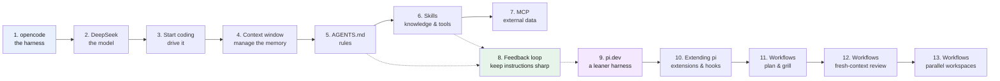

# AI Training for Software Developers

A lean guide for senior software engineers who already code well but are new to
AI-assisted development. You will learn how to drive an **AI harness** so the model
follows your solution, instead of the other way around.

> **Stack:** [opencode](https://opencode.ai/) (the harness) + DeepSeek (a cheap, capable LLM).
> **Current as of 2026-07.** AI tooling changes fast — prices, model names, and config syntax may have shifted since then. Verify before relying on specifics.

## Who this is for

You are a senior software engineer. Your practices are solid. You do not need to be
taught how to code. You want AI as a tool that assists you — and you want to know
how to make the model follow your solution when it is not great on its own.

## How to read this guide

Read in order. Each part builds on the one before. Every part ends with a short
**cheat-sheet** you can scan. Unfamiliar words are defined once in the
[glossary](glossary.md) and linked on first use.



## Contents

| # | Part | What you learn |
|---|------|----------------|
| 1 | [opencode as an AI harness](01-opencode/README.md) | What a harness is, why it beats chatting to a model, how it changes your day. |
| 2 | [DeepSeek as a cheap LLM](02-deepseek/README.md) | Why cost matters, how DeepSeek compares, the truth about "Chinese models". |
| 3 | [Start coding with opencode](03-start-coding/README.md) | Install, add a model, set up safe permissions, run your first session. |
| 4 | [The context window](04-context-window/README.md) | How messages accumulate turn by turn, why a full window causes drift, and how AGENTS.md and skills keep it lean. |
| 5 | [AGENTS.md as system instruction](05-agents-md/README.md) | Make the agent follow your solution. Global vs repo rules. |
| 6 | [Agent skills](06-skills/README.md) | Package knowledge, workflows, and tools the agent can pick on its own. |
| 7 | [MCP — when to use it](07-mcp/README.md) | Plug in third-party data/tools. Why a skill is usually the better choice. |
| 8 | [The feedback loop](08-feedback-loop/README.md) | Keep AGENTS.md and skills sharp over time, using the agent to update them. |
| 9 | [pi.dev: a leaner harness](09-pi/README.md) | A second harness with no permission system — and the two practices that keep it safe. |
| 10 | [Extending pi](10-extending-pi/README.md) | Extensions and hooks as pi's core design; packages that add MCP, sub-agents, and remote access. |
| 11 | [Workflows: plan and grill](11-workflows-plan-and-grill/README.md) | Write the plan to a file before you build, then grill every open decision to a record. |
| 12 | [Workflows: fresh-context review](12-workflows-fresh-context-review/README.md) | Spawn a fresh-context reviewer to check the work against the plan and the diff; loop until it reports nothing. |
| 13 | [Workflows: parallel workspaces](13-workflows-parallel-workspaces/README.md) | Give each parallel task its own directory, running stack, and AI session; isolate stacks with compose project names and ports. |

## Repo layout

```
AGENTS.md            ← rules for writing this guide (read this first if you contribute)
README.md            ← this file (master index)
glossary.md          ← AI terms, defined once
01-opencode/         ← Part 1
02-deepseek/         ← Part 2
03-start-coding/     ← Part 3
04-context-window/   ← Part 4
05-agents-md/        ← Part 5
06-skills/           ← Part 6
07-mcp/              ← Part 7
08-feedback-loop/    ← Part 8
09-pi/               ← Part 9
10-extending-pi/     ← Part 10
11-workflows-plan-and-grill/ ← Part 11
12-workflows-fresh-context-review/ ← Part 12
13-workflows-parallel-workspaces/ ← Part 13
sessions/            ← logs of real sessions (learning artifacts)
```

---

[→ Start with Part 1: opencode as an AI harness](01-opencode/README.md)
